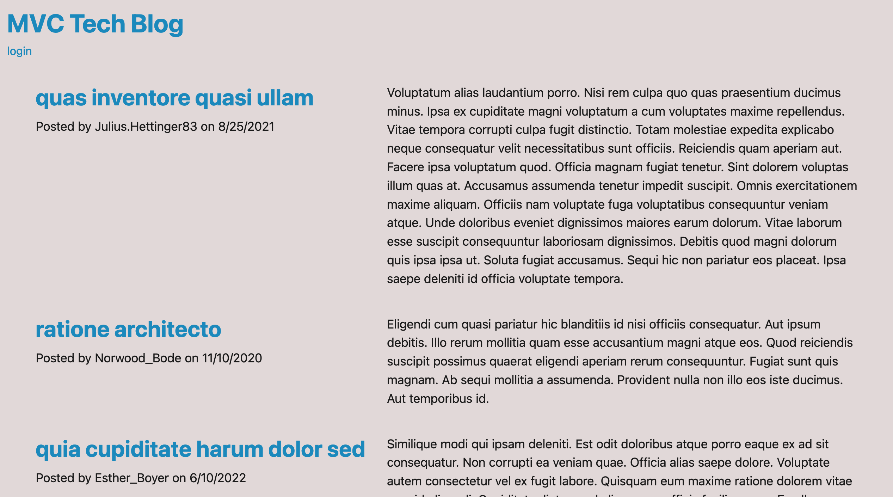

# MVC Tech Blog

## Description

The purpose of this project was to create a CMS- style blog site for users to create an account, make posts, and comment on other users' posts. This project was created using the Model-View-Controller paradigm, using Handlebars.js as the templating language, Sequelize as the ORM, and the express-session npm package for authentication.

## Usage

To use this application, visit the deployed site with the webpage link below. To run the application locally, clone the repository to your local machine, navigate to the root directory of the project in the terminal, and run `npm install` to install the dependencies. Then, run `npm start` to start the server. The application will be running at http://localhost:3001/.

## Webpage Link

https://mvc-tech-blog-ba-0cd546a6f915.herokuapp.com/

## Webpage Screenshot

## Credits

This challenge was completed in collaboration with the instructional staff (Diarmuid Murphy), TA/tutor (Meg Meyers) and classmates in the February 2023 UCLA Extension Coding Boot Camp.

## License

MIT License

Copyright (c) 2023 Brian Autieri

Permission is hereby granted, free of charge, to any person obtaining a copy of this software and associated documentation files (the "Software"), to deal in the Software without restriction, including without limitation the rights to use, copy, modify, merge, publish, distribute, sublicense, and/or sell copies of the Software, and to permit persons to whom the Software is furnished to do so, subject to the following conditions:

The above copyright notice and this permission notice shall be included in all copies or substantial portions of the Software.

THE SOFTWARE IS PROVIDED "AS IS", WITHOUT WARRANTY OF ANY KIND, EXPRESS OR IMPLIED, INCLUDING BUT NOT LIMITED TO THE WARRANTIES OF MERCHANTABILITY, FITNESS FOR A PARTICULAR PURPOSE AND NONINFRINGEMENT. IN NO EVENT SHALL THE AUTHORS OR COPYRIGHT HOLDERS BE LIABLE FOR ANY CLAIM, DAMAGES OR OTHER LIABILITY, WHETHER IN AN ACTION OF CONTRACT, TORT OR OTHERWISE, ARISING FROM, OUT OF OR IN CONNECTION WITH THE SOFTWARE OR THE USE OR OTHER DEALINGS IN THE SOFTWARE.